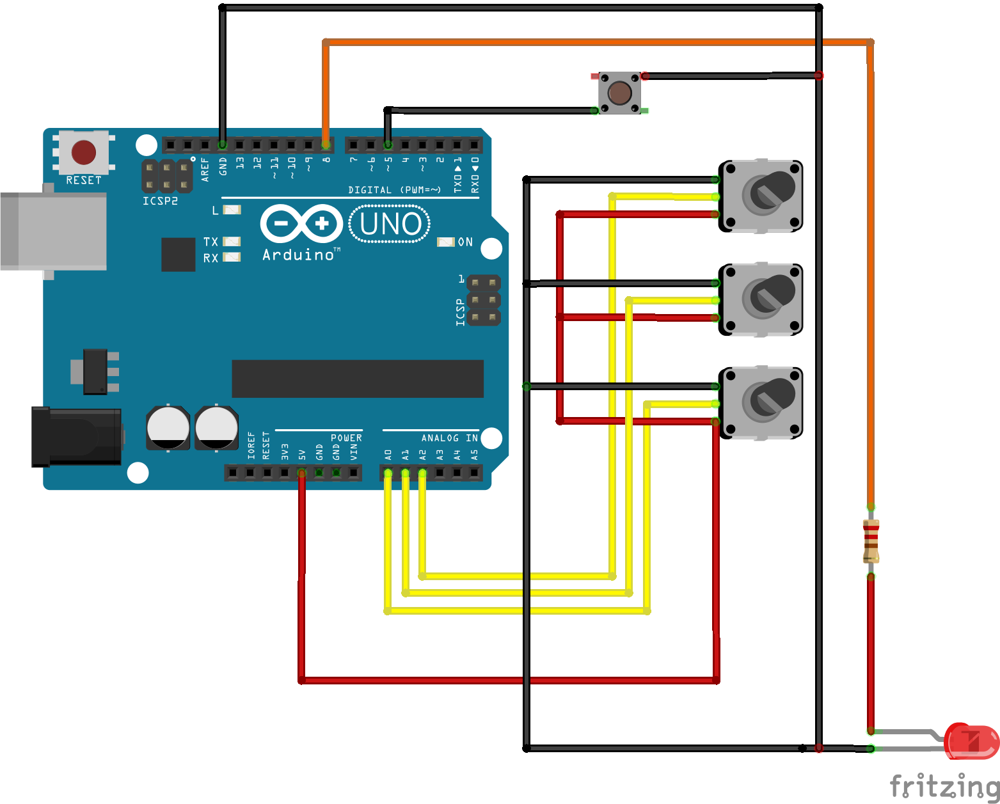
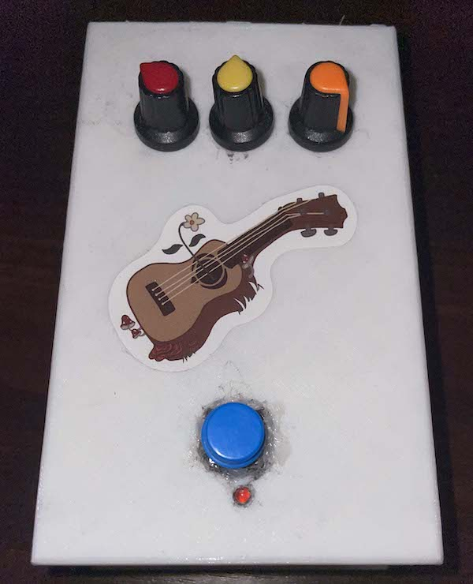

# Arduino MIDI Guitar Pedal
MIDI гитарная педаль на базе Arduino UNO

## Используемое оборудование
- Arduino UNO (оригинальная)
- 3 потенциометра
- 1 кнопка
- 1 светодиод
- 1 резистор под диод

## Используемые библиотеки и инструкции
1. https://github.com/kuwatay/mocolufa - дуал бут для Arduino USB-MIDI/Serial
2. https://github.com/FortySevenEffects/arduino_midi_library

## Схема устройства
Питание/передача данных осуществляется через встроенный в плату USB порт

## Пример сборки

